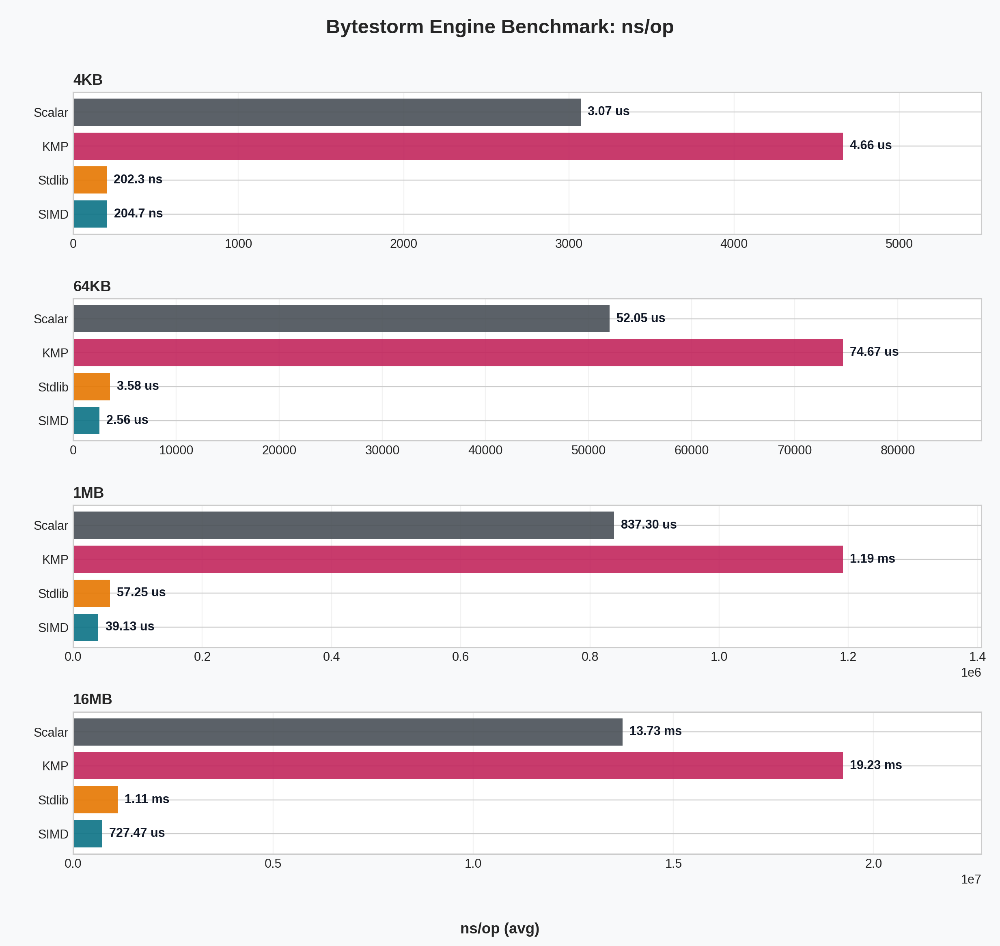
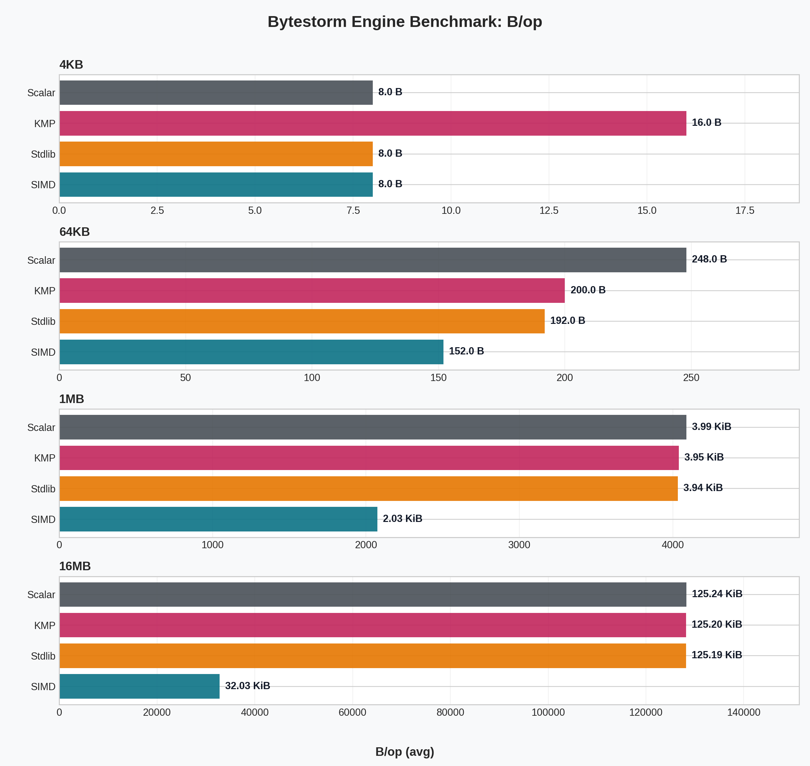
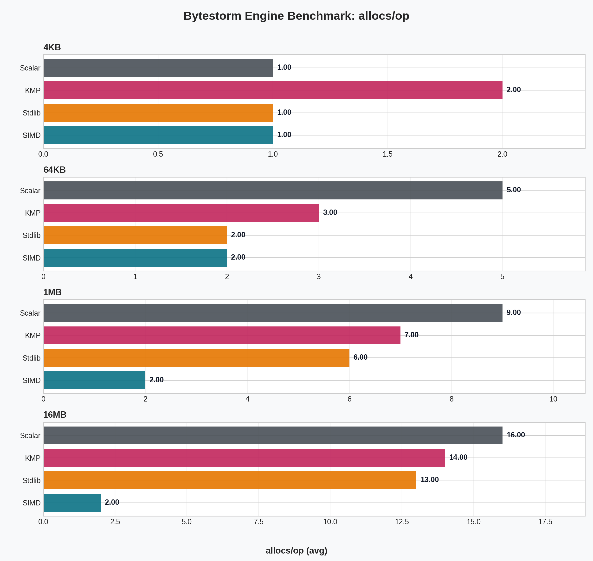
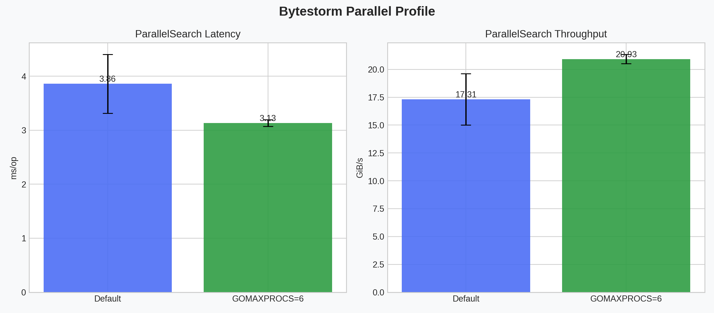

# Bytestorm

Bytestorm is a high-throughput byte-pattern search service for large streams and files. The project combines SIMD acceleration, streaming gRPC transport, and practical observability for production-like workloads.

## TODO

- Check for AVX-512 support and implement an AVX-512 engine for even higher throughput on supported hardware.
- Research and implement pool alignment (if possible) to prevent false sharing and improve cache performance in the parallel search.
- Add more detailed logging and error handling in the gRPC service for better observability in production scenarios.
- Implement benchmarks for the gRPC service layer to measure end-to-end latency and throughput under realistic workloads.

If you want to contribute or have suggestions, feel free to open an issue or submit a pull request! 😊🤗

## What Was Implemented

- Multi-engine search core:
  - Scalar baseline engine
  - KMP engine
  - Stdlib engine
  - SIMD engine for amd64 AVX2 with runtime fallback
- CPU-aware behavior:
  - AVX2 detection at runtime
  - Automatic fallback path when SIMD is unavailable
  - Small-input routing to stdlib path for lower startup overhead
- Parallel file scanning pipeline:
  - Read-only mmap file access
  - Chunk partitioning with overlap handling
  - Safe merge of cross-chunk matches
- gRPC streaming transport:
  - Streamed chunk ingestion with constant-pattern validation
  - Session tracking and optional stream summary persistence
  - Engine selection via metadata header
- Observability and infra:
  - Prometheus metrics endpoint
  - SIMD chunk metrics
  - Launcher for coordinated startup and shutdown of gRPC + metrics servers
  - YDB integration for stream summaries
- Quality envelope:
  - Unit and integration tests
  - Fuzz checks for engine consistency
  - Benchmark suite with warmup phase and repeated runs

## Final Benchmark Snapshot

Benchmarks were re-run at the end with fresh data files:

- [bench_engine_final.txt](docs/bench_results/bench_engine_final.txt)
- [bench_parallel_final_default.txt](docs/bench_results/bench_parallel_final_default.txt)
- [bench_parallel_final_pcore6.txt](docs/bench_results/bench_parallel_final_pcore6.txt)

### Engine ns/op



### Engine B/op



### Engine allocs/op



### Parallel Modes (default vs GOMAXPROCS=6)



## Key Numbers

### Important notice

I used `GOMAXPROCS=6` because I have a laptop with 6 physical cores (12 logical). Setting `GOMAXPROCS` to the number of physical cores often yields better performance for CPU-bound workloads due to reduced context switching and better cache utilization. 

### Engine comparison (avg)

| Size | SIMD GB/s | Stdlib GB/s | SIMD vs Stdlib |
| --- | ---: | ---: | ---: |
| 4KB | 20.010 | 20.247 | -1.17% |
| 64KB | 25.630 | 18.311 | +39.97% |
| 1MB | 26.794 | 18.314 | +46.32% |
| 16MB | 23.062 | 15.091 | +52.82% |

### ParallelSearch comparison (avg)

| Mode | ns/op | MB/s | B/op | allocs/op |
| --- | ---: | ---: | ---: | ---: |
| default | 3858803.0 | 17722.34 | 2647102.7 | 130.00 |
| gomaxprocs=6 | 3132616.7 | 21431.14 | 2634507.7 | 130.33 |

- Latency delta (gomaxprocs=6 vs default): -18.82%
- Throughput delta (gomaxprocs=6 vs default): +20.93%

Detailed generated tables:

- [Engine summary](docs/images/engine_summary.md)
- [Parallel summary](docs/images/parallel_summary.md)

## Reproduce Locally

1. Run benchmarks:

```console
go test ./core -run '^$' -bench BenchmarkEngineComparison -benchmem -count=3 > bench_engine_final.txt
```

```console
go test ./core -run '^$' -bench BenchmarkParallelSearch -benchmem -count=3 > bench_parallel_final_default.txt
```

```console
GOMAXPROCS=6 go test ./core -run '^$' -bench BenchmarkParallelSearch -benchmem -count=3 > bench_parallel_final_pcore6.txt`
```

2. Generate plots and markdown summaries:

```console
python3 scripts/plots/generate_plots.py --engine bench_engine_final.txt --parallel-default bench_parallel_final_default.txt --parallel-pcore6 bench_parallel_final_pcore6.txt --out-dir docs/images
```

## Current Result in One Line

On medium and large payloads, SIMD is clearly faster than stdlib, and constraining parallel workers to GOMAXPROCS=6 improved this host's parallel throughput noticeably.
